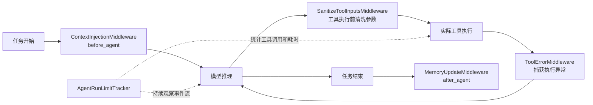

# Agent Middleware 触发机制与设计分析

## 1. 总体结论

`agent/core/middleware` 中的组件并不使用同一个触发点，因为它们处理的数据在 Agent 生命周期中的成熟时间不同。

核心设计原则是：

> 数据什么时候完整，就在什么时候处理。

- 仓库上下文在任务开始时已经确定，因此使用 `before_agent`。
- 工具参数只有模型发起工具调用时才出现，因此使用 `wrap_tool_call` 前置处理。
- 工具异常只有执行工具后才可能发生，因此通过 `wrap_tool_call` 包裹下游执行。
- 工具调用次数和运行时间需要跨越整轮任务累计，因此通过事件流持续观察。
- 最终结论在任务结束时才相对稳定，因此使用 `after_agent`。

## 2. 生命周期概览



## 3. 组件与触发点对照

| 文件 | 核心组件 | 设计触发点 | 触发频率 | 主要职责 |
|---|---|---|---:|---|
| `context_injection.py` | `ContextInjectionMiddleware` | `before_agent/abefore_agent` | 每轮 Agent 一次 | 注入仓库标识和长期记忆 |
| `tool_sanitize.py` | `SanitizeToolInputsMiddleware` | `wrap_tool_call/awrap_tool_call` | 每次工具调用 | 在工具执行前清洗参数 |
| `tool_error.py` | `ToolErrorMiddleware` | `wrap_tool_call/awrap_tool_call` | 每次工具调用 | 捕获工具执行期间的异常 |
| `run_limits.py` | `AgentRunLimitTracker` | 流式事件消费阶段 | 每个运行事件 | 累计工具次数和运行时间 |
| `momory_update.py` | `MemoryUpdateMiddleware` | `after_agent/aafter_agent` | 每轮 Agent 一次 | 在任务结束后写回长期记忆 |
| `__init__.py` | 无 | 无 | 无 | 声明 Python 包 |

## 4. ContextInjectionMiddleware

### 4.1 触发点

`ContextInjectionMiddleware` 使用 `before_agent/abefore_agent`，在整轮 Agent 开始前执行一次。

### 4.2 为什么在任务开始时触发

仓库地址、仓库标识和长期记忆属于整轮任务共享的背景信息，在一次任务中通常不会变化。如果每次模型调用前都执行，会重复访问 Store、重复插入 SystemMessage，并增加 Token 消耗。

### 4.3 设计收益

- 模型第一次推理时就能获得仓库背景。
- 每轮只注入一次，降低 Store 和 Token 开销。
- 不修改用户消息，只追加仓库上下文。
- 没有 `repo_url` 时可以跳过，不影响普通问答任务。
- 长期记忆只作为参考，真实文件和 Git 状态仍是事实来源。

## 5. SanitizeToolInputsMiddleware

### 5.1 触发点

`SanitizeToolInputsMiddleware` 使用 `wrap_tool_call/awrap_tool_call`，在每次工具执行前清洗参数。

### 5.2 为什么在工具边界触发

路径、URL、`offset`、`limit` 等参数是模型在每次工具调用时动态生成的。任务开始时还没有这些参数，因此无法提前统一校验。

```text
模型生成工具参数
    → 中间件读取 ToolCallRequest
    → 规范化或拒绝参数
    → 参数合法时调用下游 handler
```

### 5.3 设计收益

- 在文件系统或网络请求发生前拦截危险参数。
- 多个工具共享统一的路径和 URL 规则。
- 业务工具不需要重复编写通用参数校验。
- 参数错误被转换成结构化 `ToolMessage`，模型可以修正后继续。
- 通过 `request.override()` 创建新请求，避免修改原始调用对象。
- `LocalShellBackend` 保留最终安全校验，形成双层安全边界。

## 6. ToolErrorMiddleware

### 6.1 触发点

`ToolErrorMiddleware` 同样使用 `wrap_tool_call/awrap_tool_call`，但它通过 `try/except` 包裹下游工具执行。

### 6.2 与参数清洗的区别

```text
SanitizeToolInputsMiddleware：在执行前防止明显错误发生
ToolErrorMiddleware：错误已经发生后负责兜底恢复
```

参数清洗处理路径穿越、敏感目录和参数类型等可提前识别的问题。错误中间件处理文件不存在、权限不足、网络失败和工具超时等运行时问题。

### 6.3 设计收益

- 业务工具不必分别维护大量 `try/except`。
- 将不同异常转换成统一、结构化的中文错误结果。
- 一次工具失败不会立即终止整轮 Agent。
- 模型可以根据 `error` 和 `hint` 调整参数或切换方案。
- 能把前端原来的 `in_progress` 事件更新为 `error`，避免界面长期显示运行中。
- 同时记录通用工具错误事件，便于排查。

## 7. AgentRunLimitTracker

### 7.1 触发点

`run_limits.py` 中的 `AgentRunLimitTracker` 没有继承 `AgentMiddleware`，它被设计为在 LangGraph 流式事件消费阶段持续调用 `observe_event()`。

### 7.2 为什么不使用固定生命周期钩子

运行限制关注的是跨步骤累计状态，包括工具调用次数、运行时间和重复循环风险。`before_agent` 看不到执行过程，`after_agent` 又已经太晚，所以需要伴随事件流持续检查。

### 7.3 设计收益

- 跨多个模型循环累计工具调用。
- 每个事件到达时都能检查运行时间。
- 不依赖具体模型供应商。
- 不使用模型消息分块推算模型调用次数，减少误判。
- 可针对 `coding`、`qa`、`planning` 等任务设置不同阈值。
- 超限后可以主动终止事件流，控制费用和执行时间。

## 8. MemoryUpdateMiddleware

### 8.1 触发点

`MemoryUpdateMiddleware` 使用 `after_agent/aafter_agent`，在整轮 Agent 结束后执行。

### 8.2 为什么在任务结束后触发

中间过程可能包含尚未验证的猜测、失败方案、临时工具输出和随后被推翻的阶段性结论。任务结束后的最后一条 assistant 消息通常更接近稳定总结，因此更适合提炼长期记忆。

### 8.3 设计收益

- 每轮任务通常只写一次 Store。
- 避免把完整对话和工具日志写入长期记忆。
- 只提取最后一条 assistant 消息，降低过程噪声。
- 写入前统一做敏感信息检查和 Token 脱敏。
- 可作为主运行路径之外的兜底，避免新增入口忘记更新记忆。

## 9. 为什么这种分层优于统一触发

如果把所有逻辑都放在同一个钩子中：

- `before_agent` 无法获得工具参数和执行异常。
- 每次 `wrap_tool_call` 重复注入仓库记忆会浪费 Token。
- `after_agent` 再检查工具参数已经太晚。
- 仅在任务结束后检查运行时间，无法阻止失控循环。
- 长期记忆、参数安全和异常处理混在一起会增加耦合。

分层后形成清晰结构：

```text
开始阶段：准备上下文
执行阶段：校验输入
异常阶段：统一恢复
全过程：限制资源
结束阶段：沉淀结果
```

## 10. 总体设计收益

- **职责单一**：每个文件只处理一种横切能力。
- **降低开销**：不变内容不会在每次调用时重复处理。
- **支持自我恢复**：参数和运行异常会返回结构化 `ToolMessage`。
- **统一安全策略**：路径、敏感目录、脱敏和阈值集中维护。
- **同步异步一致**：同步和异步路径都有对应钩子。
- **便于测试**：上下文、参数、错误、限制和记忆可以分别测试。

## 11. 当前代码的实际接入状态

当前仓库中暂未找到以下组件的注册或调用位置：

- 没有找到把这些中间件实例传入 `create_agent` 或 `create_deep_agent` 的代码。
- 没有找到 `AgentRunLimitTracker` 的实例化和 `observe_event()` 调用。

因此，目前实际状态是：

> 文件中已经定义生命周期触发点，但如果没有在 Agent 创建和事件消费链路中显式注册，它们不会自动触发。

## 12. 当前实现中需要关注的问题

以下问题不影响生命周期设计思路，但会影响接入后的实际运行。

### 12.1 `context_injection.py`

- 使用了未导入的记忆路径、namespace 和 Store 函数。
- `GitHubRepo` 只有 `owner`、`repo`、`clone_url` 字段，但代码使用了 `repo.name`。
- `_build_repo_content_notice()` 接收 `memory_content`，调用时却传入 `content`。

### 12.2 `momory_update.py`

- 文件名中的 `momory` 可能是 `memory` 的拼写错误。
- `update_repo_memory_from_text`、`get_langgraph_store` 和 `RepoMemoryUpdate` 没有导入或定义。

### 12.3 `tool_sanitize.py`

- macOS 绝对路径判断使用了 `PureWindowsPath` 和 Windows 盘符正则，无法正确覆盖常见的 `/Users/...` 路径。
- GitHub URL 清洗逻辑仍然判断 `gitee.com`。
- `normalize_github_repo_url` 没有导入或定义。
- 拒绝事件记录中的 `thread_id` 判断方向相反：存在 `thread_id` 时提前返回。

### 12.4 `tool_error.py`

- 同步路径调用 `_error_tool_message()` 时，实参与函数签名不一致。
- 当前实现捕获所有异常，接入时需要区分可恢复异常与系统配置错误，避免对不可恢复错误持续重试。

### 12.5 `run_limits.py`

- `_first_payload()` 在 `params` 是字典时直接返回 `None`，导致正常事件无法继续读取 `params["data"]`。
- 目前没有事件消费代码调用 Tracker，因此阈值不会实际生效。

## 13. 最终评价

从架构意图看，这套中间件设计是合理的：

- 触发点与数据生命周期匹配；
- 参数清洗和异常处理形成前后两道防线；
- 上下文注入和记忆写回形成任务首尾闭环；
- 运行限制覆盖整个执行过程；
- 每个模块职责清楚，便于扩展和测试。

当前主要问题不在于触发点选择，而在于这些组件仍处于开发接线阶段。完成注册、修正未定义依赖和参数错误后，这种生命周期分层能够明显提升 Agent 的安全性、稳定性、可恢复性和可维护性。
